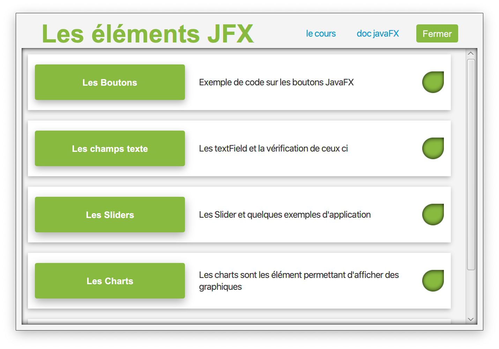

# gegeLib
Application desktop d'exemple d'utilisations des éléments de JavaFX

Ce soft est mis à jour en fonction de l'avancement des ressources sur le [cours](https://germainsip.github.io/post/cours/java/javafxelmts/)

## Utilisation

- Téléchargez ou clonez le dépot

Lancez ensuite le projet dans votre IDE et lancez directement la tache Gradle **application/run**

- Pour créer l'installateur ou simplement un exécutable lancez la tache **build/jpackage**
